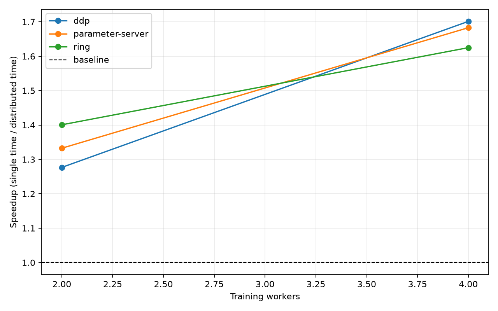
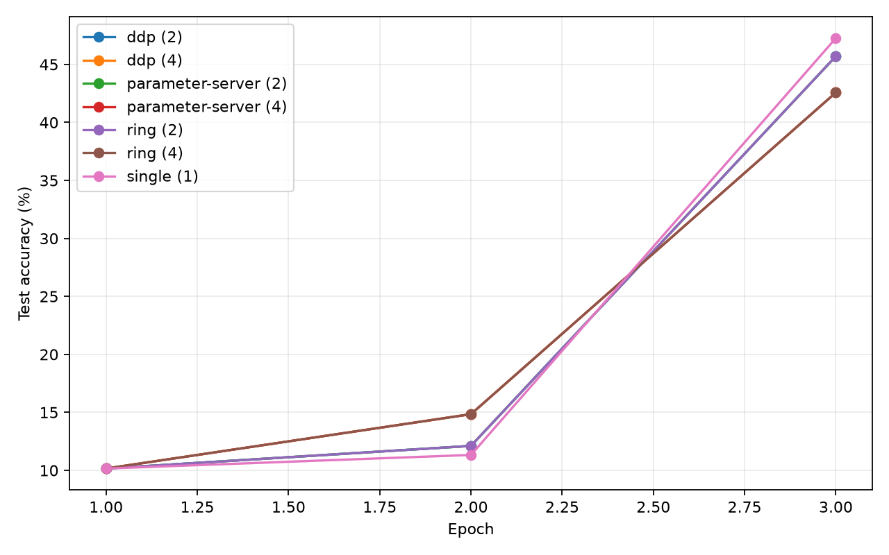
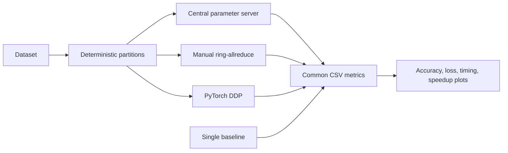

# CPU Distributed Training Benchmarks

[](https://github.com/Bahareh527/cpu-distributed-training-benchmarks/actions/workflows/ci.yml)
[](https://www.python.org/)
[](LICENSE)

A reproducible, CPU-only comparison of four PyTorch training architectures:

- single-process training as the reference baseline;
- a synchronous centralized parameter server;
- manual ring-allreduce using point-to-point communication; and
- PyTorch `DistributedDataParallel` (DDP).

The repository grew from a Vrije Universiteit Brussel group project and was rebuilt as a
reviewable engineering portfolio project. The revised version uses a common model, dataset,
global batch size, metric schema, and timing protocol across every approach.



## What this project demonstrates

| Method | Communication pattern | Gradient update | Implementation |
|---|---|---|---|
| Single | None | Local optimizer | One process |
| Parameter server | Workers communicate through one server | Server averages gradients and updates one global model | Multiprocessing pipes |
| Ring-allreduce | Each worker exchanges chunks with its two neighbours | Reduce-scatter followed by all-gather | Manual PyTorch P2P operations |
| DDP | Collective allreduce | Automatic synchronized gradients | PyTorch reference implementation |

For the parameter-server experiment, `--workers N` means **N training workers plus one server
process**. For ring and DDP, it means N training processes. This distinction is explicit in both
the code and documentation.

## Engineering improvements

- One shared CNN and data pipeline instead of four duplicated implementations.
- A fixed global batch size; local batch size is `global_batch_size / workers`.
- Non-overlapping, equal-length training partitions for synchronous methods.
- Global loss and accuracy aggregated across all workers.
- Epoch time measured as the slowest training worker, not an arbitrary rank.
- Deterministic seeds and explicit CPU thread budgets.
- A synthetic offline dataset for fast, network-free validation.
- Optional MNIST experiments without committing downloaded data.
- Automated unit tests plus real two-process parameter-server, ring, and DDP smoke tests.

## Quick start

Create a Python 3.10+ environment and install the package:

```bash
python -m venv .venv
python -m pip install -e ".[dev]"
```

Run the same three-epoch synthetic benchmark with a global batch size of 128:

```bash
python train_single.py --epochs 3 --out logs/single.csv
python train_ps.py --workers 2 --epochs 3 --out logs/parameter-server-2.csv
python train_ringallreduce.py --workers 2 --epochs 3 --out logs/ring-2.csv
python train_ddp.py --workers 2 --epochs 3 --out logs/ddp-2.csv
python plot_results.py --logs logs --output artifacts/figures
```

The distributed launchers create their local worker processes themselves; `torchrun` is not
required. The Gloo backend is used for CPU collective and point-to-point communication, following
the [PyTorch distributed guidance](https://docs.pytorch.org/docs/stable/distributed).

### Run with MNIST

MNIST is downloaded to the ignored `data/` directory on first use:

```bash
python train_ddp.py \
  --workers 4 \
  --dataset mnist \
  --train-size 60000 \
  --test-size 10000 \
  --epochs 5 \
  --out logs/ddp-4-mnist.csv
```

## Reproducible smoke result

The committed figures use the small synthetic configuration stored in
[`examples/synthetic-smoke.csv`](examples/synthetic-smoke.csv): 1,024 training samples, 256 test
samples, three epochs, a global batch size of 128, and one CPU thread per training worker.



The matching distributed learning curves are a correctness signal: the centralized server,
manual ring, and DDP average the same gradients under the same worker count. Timing values are
only a smoke example from one Windows machine—not a general performance claim. Reliable speedup
conclusions require repeated runs, warm-up removal, hardware metadata, and confidence intervals;
see [the benchmarking protocol](docs/benchmarking.md).

## Architecture



The ring implementation uses batched non-blocking point-to-point operations so the relative
send/receive ordering cannot deadlock, as specified by
[`torch.distributed.batch_isend_irecv`](https://docs.pytorch.org/docs/stable/distributed#torch.distributed.batch_isend_irecv).
DDP uses one CPU model replica per process with `device_ids=None`, consistent with the
[`DistributedDataParallel` API](https://docs.pytorch.org/docs/stable/generated/torch.nn.parallel.DistributedDataParallel.html).

## Repository structure

```text
.
├── src/distributed_training/  # Shared model, data, communication, metrics, plotting
├── tests/                     # Unit tests
├── docs/                      # Benchmarking protocol and generated figures
├── examples/                  # Reproducible synthetic smoke output
├── train_single.py            # Baseline entry point
├── train_ps.py                # Centralized parameter-server entry point
├── train_ringallreduce.py     # Manual ring entry point
├── train_ddp.py               # DDP entry point
└── plot_results.py            # Comparable plots from the shared CSV schema
```

## Scope and limitations

- This is a single-machine CPU teaching benchmark, not a production training platform.
- The synthetic dataset validates coordination and reproducibility; it is not a scientific task.
- The parameter server uses local process pipes because PyTorch RPC availability varies by build.
  The centralized topology and server-owned optimizer remain explicit.
- Performance depends on CPU topology, PyTorch build, thread settings, operating system, and
  background load.
- Fault tolerance, multi-node rendezvous, checkpoint recovery, and GPU/NCCL execution are outside
  the current scope.

## References

- PyTorch. [Distributed communication package](https://docs.pytorch.org/docs/stable/distributed).
- PyTorch. [DistributedDataParallel](https://docs.pytorch.org/docs/stable/generated/torch.nn.parallel.DistributedDataParallel.html).
- Li et al. [Scaling Distributed Machine Learning with the Parameter Server](https://www.usenix.org/conference/osdi14/technical-sessions/presentation/li_mu).
- Patarasuk and Yuan. [Bandwidth Optimal All-reduce Algorithms for Clusters of Workstations](https://doi.org/10.1016/j.jpdc.2009.05.002).

## License

Code is released under the [MIT License](LICENSE).
